# 🐈‍ 냥그릇 v2

## 🐱 서비스 개요

이전 냥그릇v1과 달리, v2에서는 AI를 통한 급식소를 이용하는 고양이의 개체 수 확인과 중성화 여부를 파악하여 지자체에게 정보를 제공함으로써 지자체의 고양이 중성화 사업에 기여하는 서비스.

v2에서는 지자체(Web), 캣맘(App), 일반 사용자(Web-Landing Pag)로 유저 별 맞춤형으로 접근성을 강화하였음. 또한, v1에서는 OpenCV 라이브러리를 통해 단순 고양이 인식을 통해 서비스하였지만, v2에서는 YOLOv5, MobileNet 모델을 자체적으로 학습하여 서비스를 제공함.

👉🏼[_냥그릇v1 보러가기_](https://github.com/jaypakkorea/OurKitty)

### 📌 개발 기간

2023.04.10 ~ 2023.05.19 (6주)

### 📌 참여 인원(6명)

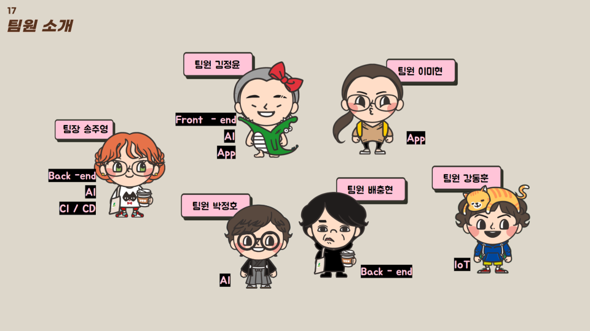

### 📌 UCC

[https://www.youtube.com/watch?v=fRJ7YMKYPlk](https://www.youtube.com/watch?v=fRJ7YMKYPlk)

## 🐱 기획배경

정부는 연간 140억 원을 들여 길고양이 문제 해결을 시도하지만 아래와 같은 이유로 사회 이슈가 되는 부분이 있음.

1. 일부 업자들의 **불법행위**(불법 포획으로 인한 동물 학대, 집고양이를 길고양이로 속여 중성화 의뢰)
2. 하루 3~4시간씩 현장에 나가 개체수를 조사하는 **목시 조사**

그리고 농림축산식품부에서 예산을 보다 효율적으로 관리하기 위해 권역에 있는 고양이 75%이상을 일제히 중성화 하는, 군집 중성화 수술을 유도하고 포획업체와 동물병원 관리 감독을 강화하는 정책을 발표함(보도 일시: 2023.03.12)

## 🐱 구현 기능

### 🦋 Web (지자체)

-   관할지역 정보(냥그릇 위치, 상세정보, 관리일지) 등록/조회/수정/삭제
-   사용자 관리(등록/조회/검색/수정/삭제/임시차단)
-   민원 조회/검색/상태 수정
-   차트 시각화 (HeatMap, Scatter Plot, Line Chart)
-   이미지 클러스터링 결과 수정
-   다크모드

### 🦋 Web-Landing Page (일반유저)

-   프로젝트 '냥그릇' 상세 정보 확인 & 후원

### 🦋 Mobile (캣맘)

-   휴대폰번호와 인증번호로 로그인
-   관할 냥그릇 정보 조회(위치, 잔여 사료양, 배터리 양, 방문 고양이 사진)
-   관리일지 관리 (일지 작성/조회/수정/삭제, 댓글 작성/삭제)

### 🦋 IoT

1. 사료통
    - 2리터가 넘는 사료통을 장착해서 기존 냥그릇에 비해서 관리가 쉬워짐
    - 모터를 이용한 자동급식기능. 그릇에 광센서를 이용해서 사료통이 비면 급식
    - 초음파센서를 이용해서 현재 급식통에 얼마나 사료가 남았는지 측정. 어플에서 확인 가능
2. 카메라
    - 플래시를 이용해서 야간에도 사진을 찍을 수 있음
3. 네트워크
    - 라우터를 이용해서 전원만 공급되면 인터넷 사용 가능
4. 배터리
    - ADC 핀을 이용해서 배터리 잔여량 측정. 어플에서 확인 가능

### 🦋 AI

-   고양이 얼굴 판별 AI모델
-   인간의 지도학습 없이 스스로 유사도를 판단해 하루동안 촬영된 사진들을 클러스터링 해주는 인공지능 모델 개발
-   TNR여부 판단 모델
-   길고양이 왼쪽 귀 인식후 Auto-Labeling해주는 인공지능 구현 및 IoT가 확보하고 스스로 라벨링한 자체 데이터를 기반 인공지능 모델 고도화 플랫폼 개발

## 🐱 시연

### 🦋 Web (지자체)

1. 대시보드

-   냥그릇 상세정보(급식소 위치, 개체수 정보, 배터리 잔여량, 사료량)

2. 사용자 관리

-   회원 관리 및 차단, 탈퇴회원 관리

3. 냥그릇 관리

-   기기 등록, 수정, 삭제 및 관련 관리일지 조회

4. 개체 수 관리

-   인공지능이 파악한 개체 수 파악 및 개체 수, 중성화 수 관리

5. 차트

-   차트로 개체 수, 중성화 수 파악

6. 민원 관리

-   냥그릇 별 민원 조회 기능

7. 다크모드

### 🦋 Web-Landing Page (일반유저)

사업화 상황 확인 및 후원하기

### 🦋 Mobile (캣맘)

1. 로그인 기능

-   인증된 회원만 접속할 수 있도록 휴대폰 번호와 인증번호로 로그인

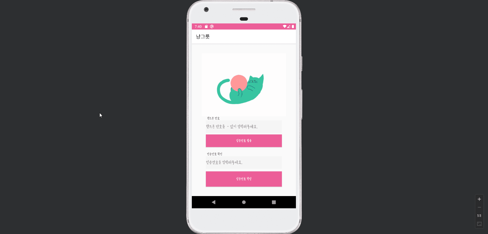

2. 냥그릇 상세 조회

-   급식소 위치, 배터리 잔여량, 사료량, 방문 고양이 사진

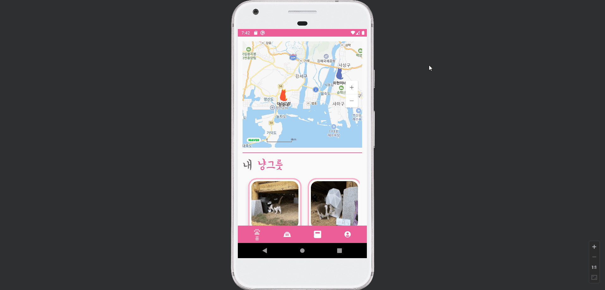

3. 관리일지

-   냥그릇 별 관리일지 조회 및 관리일지 작성

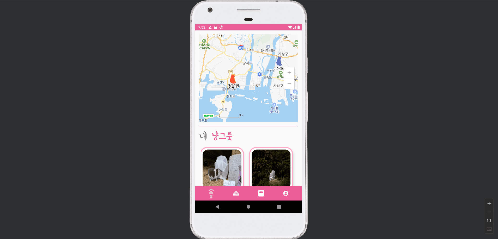

-   댓글기능

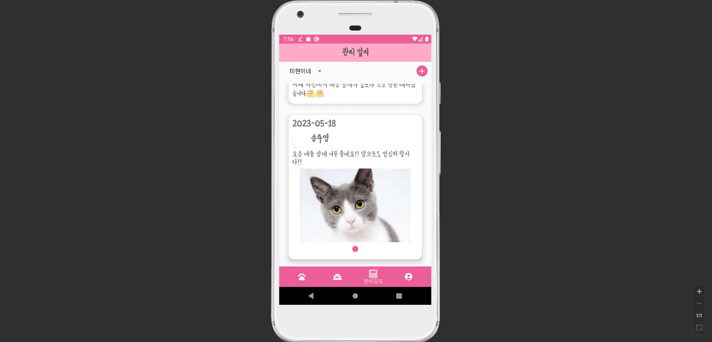

### 🦋 IoT

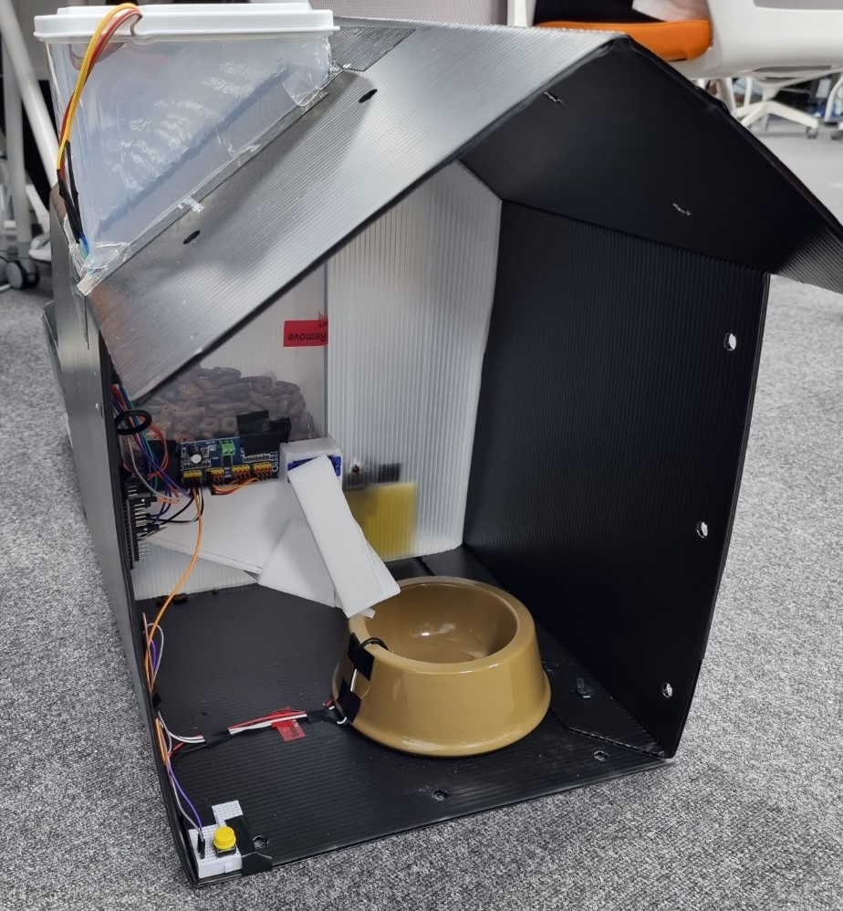

1. 카메라

-   플래시로 야간 촬영

2. 광센서로 사료통 문 개폐

    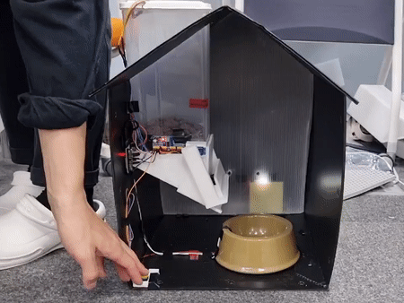

    발표 시연을 쉽게 하기 위해 임의로 버튼을 통해 개폐함

    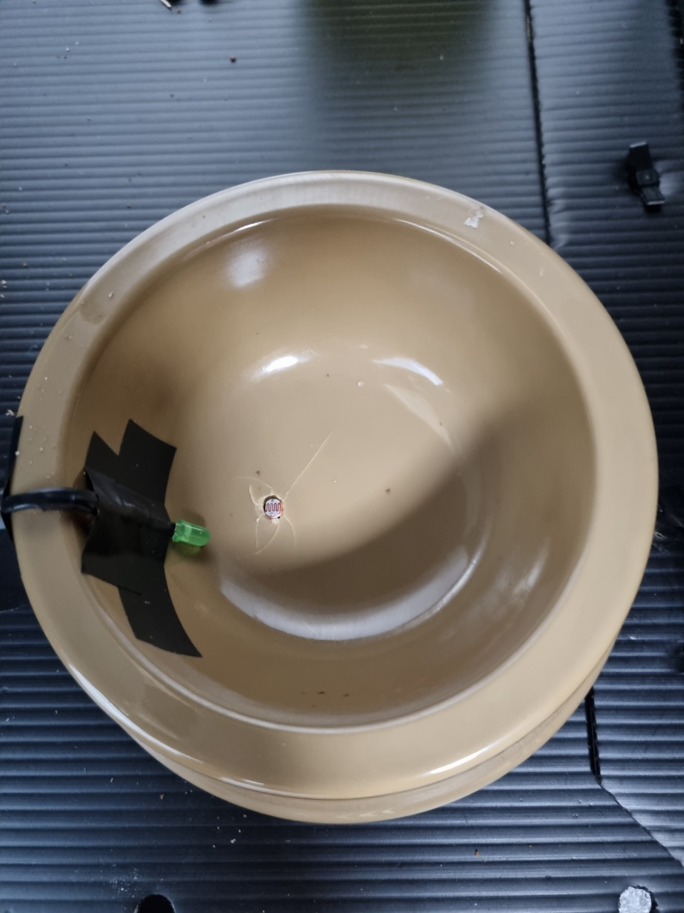

    광센서가 부착되어 있는 부분 (초록색)

    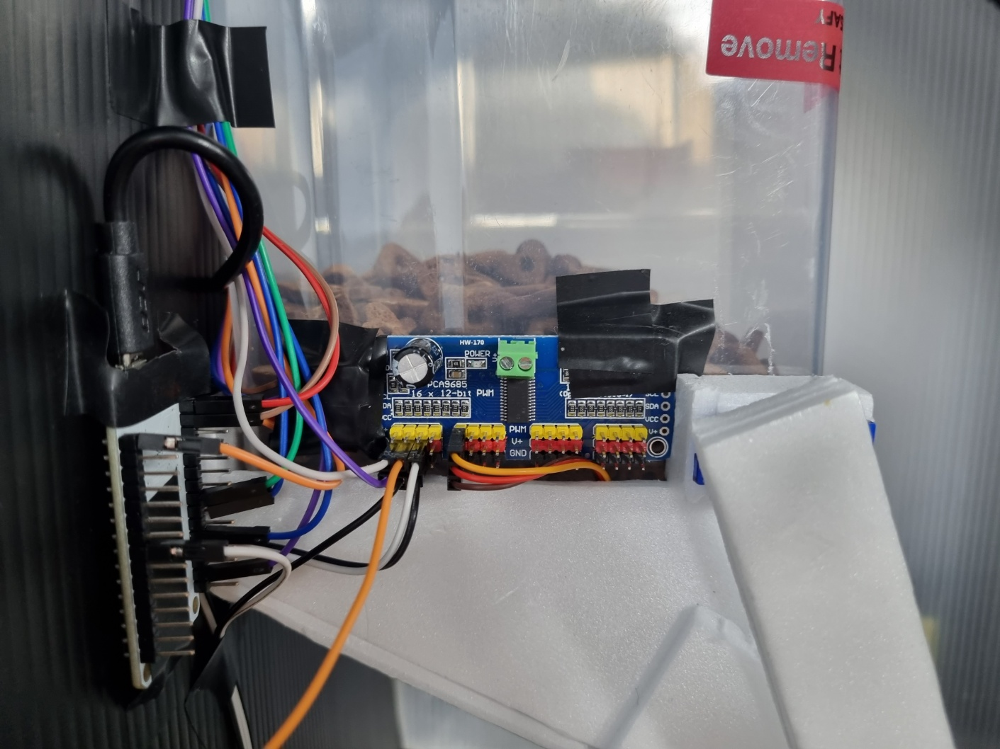

    개폐부분 모터

3. 초음파 센서로 사료 잔여량 측정

    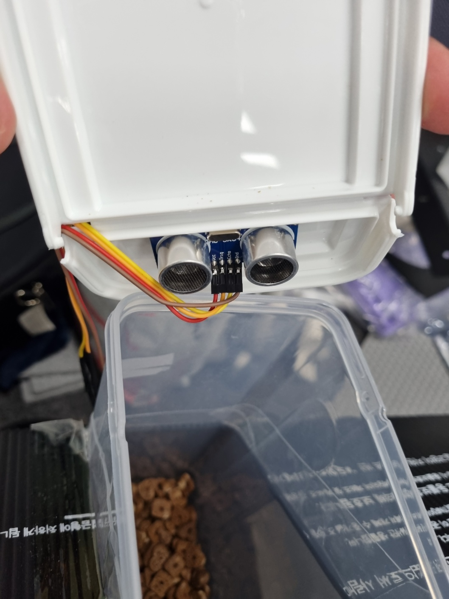

4. 배터리 전압으로 배터리 잔여량 측정

    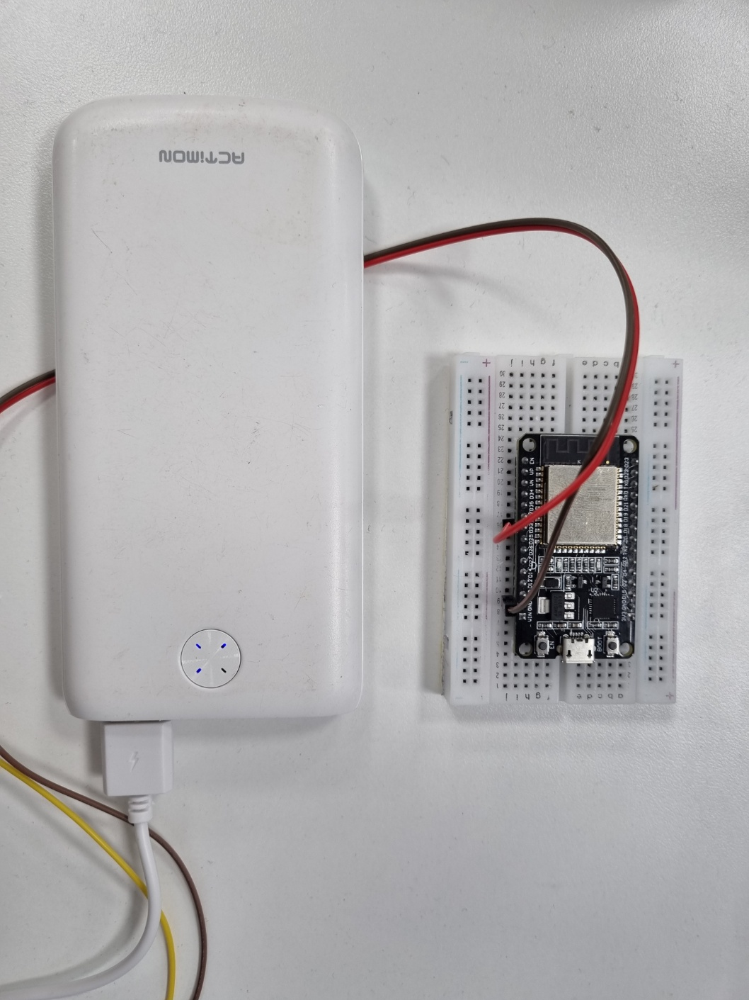

## 🐱 기술 스택

### 🦋 Web Front

-   React - 18.2.0
-   TypeScript - 4.9.5
-   Tailwind - 3.3.1
-   Recoil - 0.707
-   ReactQuery - 3.39.3

### 🦋 Web Front

-   Kotlin - 1.8.0
-   android application - 8.0.0
-   Retrofit2 - 2.9.0
-   Glide - 4.12.0

### 🦋 Back

-   Java - openjdk 11.0.18
-   Kotlin - 1.8.20
-   Spring Boot - 2.7.10
-   Mysql - 8.0.31

### 🦋 AI

-   YOLOv5
-   Python 3.9
-   MobileNet v2
-   Tensorflow 2.12.0

### 🦋 IoT

-   ESP32CAM
-   ESP32
-   PCA9685 16-Channel 12-bit Driver
-   SG-90 서보모터
-   HC-SR04
-   CdS Cell (GL5537)

### 🦋 CI/CD

-   Jenkins - 2.387.2
-   Docker - 23.0.4
-   AWS EC2
-   AWS S3
-   SonarQube - 9.9

## 🐱 프로젝트 산출물

### 🦋 ER Diagram

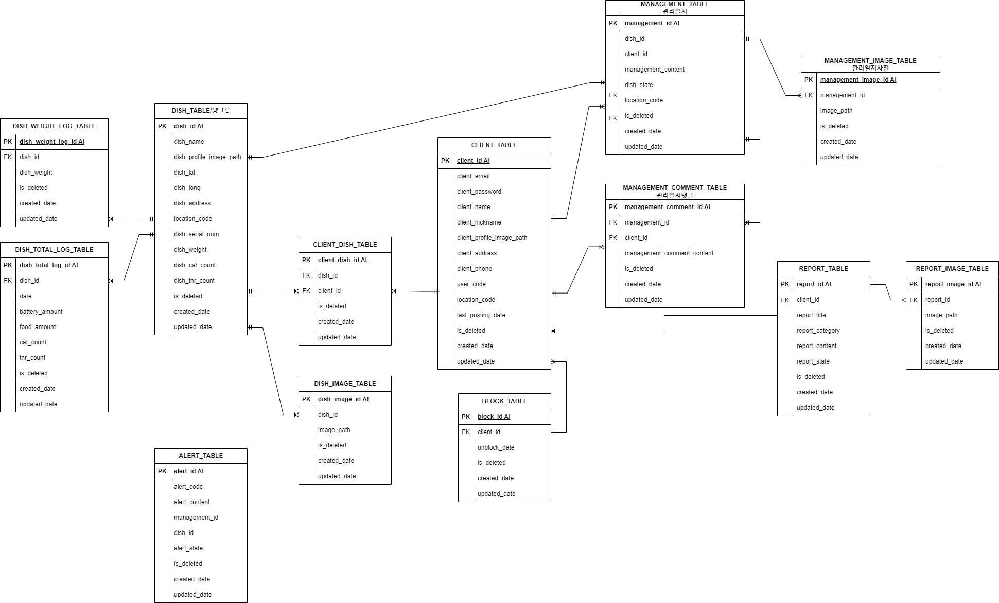

### 🦋 Architecture Structure

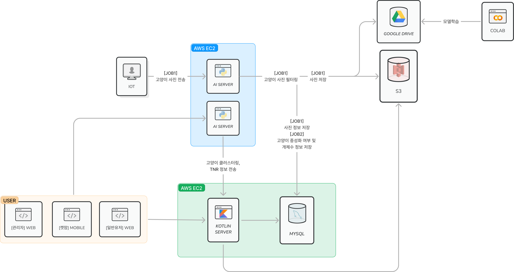

### 🦋 AI Sequence Diagram

-   Dataset 쌓기
    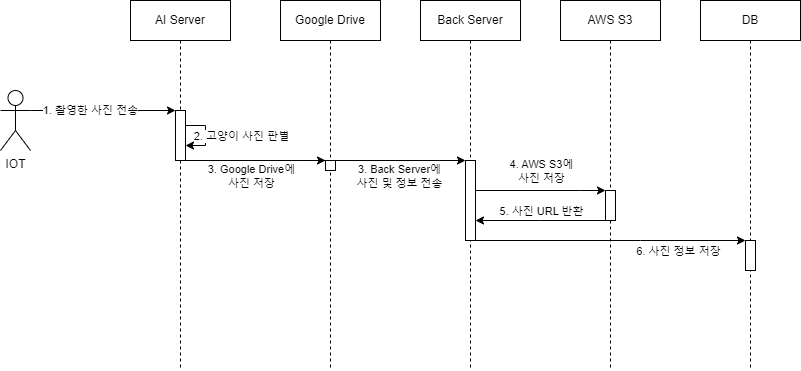
-   Clustering & TNR
    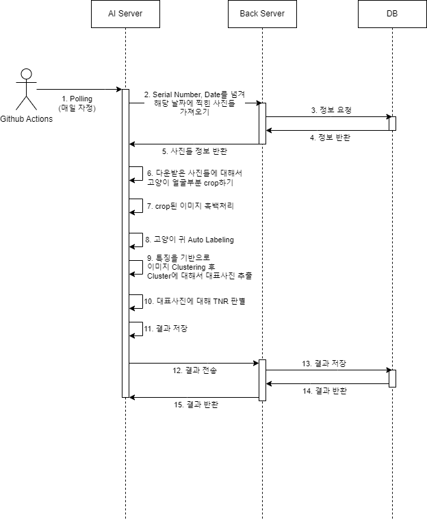

### 🦋 SonarQube

SonarQube를 통해 코드리뷰 진행

